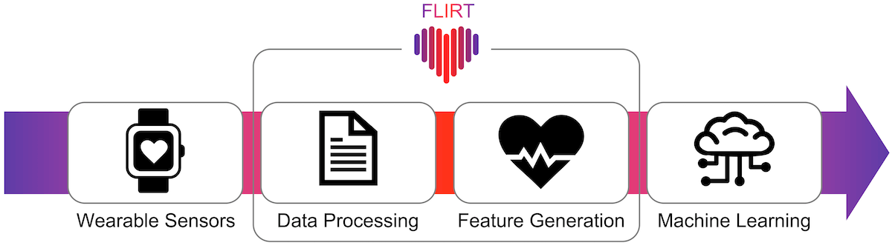

FLIRT
=====

|Python Versions| |PyPI| |Documentation Status| |Binder|

⭐️ **Simple. Robust. Powerful.**

FLIRT is a feature generation toolkit for wearable data such as that from your smartwatch or smart ring. With FLIRT you can
easily transform wearable data into meaningful features which can then be used for example in machine learning or AI models.

In contrast to other existing toolkits, FLIRT (1) focuses on physiological data recorded with
(consumer) **wearables** and (2) calculates features based on a **sliding-window approach**.
FLIRT is an easy-to-use, robust and efficient feature generation toolkit for your wearable device!

➡️ **Are you ready to FLIRT with your wearable data?**

Main Features
-------------

A few things that FLIRT can do:

- Loading data from common wearable device formats such as from the Empatica E4 or Holter ECGs

- Overlapping sliding-window approach for feature calculation

- Calculating `HRV <api.html#module-flirt.hrv>`_ (heart-rate variability) features from NN intervals (aka inter-beat intervals)

- Deriving features for `EDA <api.html#module-flirt.eda>`_ (electrodermal activity)

- Computing features for `ACC <api.html#module-flirt.acc>`_ (accelerometer)

- Provide and prepare all features in one comprehensive DataFrame, so that they can directly be used for further steps (e.g. training machine learning models)

😎 FLIRT provides **high-level** implementations for fast and easy utilization of feature generators (see
`flirt.simple <api.html#module-flirt.simple>`_).

🤓 For advanced users, who wish to adapt algorithms and parameters to
their needs, FLIRT also provides **low-level** implementations. They
allow for extensive configuration possibilities in feature generation
and the specification of which algorithms to use for generating
features.

Installation
------------

FLIRT is available from `PyPI <https://pypi.org/project/flirt/>`_ and can be installed via pip:

::

   pip install flirt

See :doc:`installation` for further info.

Quick example
=============

Generate a comprehensive set of features for an Empatica E4 data archive with a single line of code 🚀

::

   import flirt
   features = flirt.with_.empatica('./1234567890_A12345.zip')

Check out the exemplary `Jupyter notebooks <https://github.com/im-ethz/flirt/tree/master/notebooks/>`_.

Authors
=======

Made with ❤️ at `ETH Zurich <https://im.ethz.ch>`_.

Check out all :doc:`authors`.

FAQs
====

-  **How does FLIRT distinguish from other physiological data processing
   packages such as neurokit?**  \
   While FLIRT works with physiological data like other packages, it
   places special emphasis on the inherent challenges of data processing
   obtained from (consumer) wearable devices such as smartwaches instead
   of professional, medical-grade recording devices such as ECGs or
   EEGs. As an example, when processing data from smartwatches, one
   could be confronted with inaccurate data, which needs artifact
   removal, or measurement gaps, which need to be dealt with.

.. |Python Versions| image:: https://img.shields.io/pypi/pyversions/flirt.svg?logo=python&logoColor=FFE873
   :target: https://pypi.org/project/flirt/
.. |PyPI| image:: https://img.shields.io/pypi/v/flirt.svg?logo=pypi&logoColor=FFE873
   :target: https://pypi.org/project/flirt/
.. |Documentation Status| image:: https://readthedocs.org/projects/flirt/badge/?version=latest
   :target: https://flirt.readthedocs.io/en/latest/?badge=latest
.. |Binder| image:: https://mybinder.org/badge_logo.svg
   :target: https://mybinder.org/v2/gh/im-ethz/flirt/master
