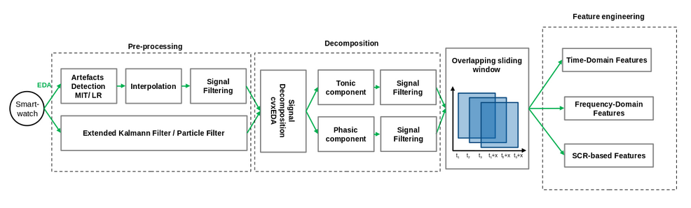

EDA Analysis
============

Introduction
-------------

We present a modular, user-friendly EDA processing pipeline in order to retrieve reliable EDA measures, which can be directly utilized by machine learning algorithms to predict health conditions, arousal levels, etc.... \ 
The pipeline consists of three main parts: raw EDA signal cleaning to remove high frequency noise and artefacts, decomposition into tonic and phasic components, and EDA feature generation. \
We put a special emphasis on tailoring the algorithms to data collected with wearable devices in uncontrolled environments. This requires increasing the \
reliability of the measures against movements artifact and noise, calculating novel EDA features that highly correlate with the autonomous nervous system (ANS), and providing parameters that are accurately tuned for this purpose. An overview of the processing pipeline implemented is shown in the Figure below.

To get the EDA features, one must use the function `get_eda_features() <../api.html#module-flirt.eda>`_, where a filtering algorithm, a decomposition algorithm and a peak detection algorithm can be specified. \
The function can be called without specifying any parameters, just relying on the default algorithms, which were set to be low-pass filtering, followed by CvxEDA decomposition, and finally \
MITPeaks detection. The default parameters for each algorithm were set to maximise performance and increase robusteness when considering wearable-recorded data. The default algorithms can easily be changed and the algorithm's default parameters can betuned depending on the application. \
A guide to tuning the main parameters is specified in the Table 1 below.

Table 1: *Summary of the most influential parameters of the pre-processing pipeline and how to tune them to obtain robust EDA features*

+------------------------+-------------------------------+------------------------------------------------------------------------------+
| **Algorithm**          | Main Parameters to Tune       | Effect of Tuning                                                             |
+========================+===============================+==============================================================================+
| LowPassFilter()        | cutoff                        | By decreasing it, can filter out more data                                   |
|                        +-------------------------------+------------------------------------------------------------------------------+
|                        | filter                        | Type of filtering method, choose based on application and data               |
+------------------------+-------------------------------+------------------------------------------------------------------------------+
| ExtendedKalmanFilter() | alpha                         | Higher is better, low values produce oscillatory, high-error signals         |
|                        +-------------------------------+------------------------------------------------------------------------------+
|                        | d\_min - d\_max               | Reduce this range to filter out more data                                    |
|                        +-------------------------------+------------------------------------------------------------------------------+
|                        | min\_diff - max\_diff         | Reduce this range to filter out more artefacts                               |
|                        +-------------------------------+------------------------------------------------------------------------------+
|                        | min\_Savi\_Go - max\_Savi\_Go | Reduce this range to filter out more artefacts                               |
+------------------------+-------------------------------+------------------------------------------------------------------------------+
| ParticleFilter()       | num\_particles                | Increase for more accurate result but higher computing time                  |
|                        +-------------------------------+------------------------------------------------------------------------------+
|                        | P0\_variance, Q\_variance     | Reduce these model variances to filter out more data                         |
|                        +-------------------------------+------------------------------------------------------------------------------+
|                        | R\_variance                   | Reduce this measurement noise variance to filter out more data               |
+------------------------+-------------------------------+------------------------------------------------------------------------------+
| MitExplorerDetector()  | None                          | No tuning needed                                                             |
+------------------------+-------------------------------+------------------------------------------------------------------------------+
| LrDetector()           | None                          | No tuning needed                                                             |
+------------------------+-------------------------------+------------------------------------------------------------------------------+
| CvxEda()               | delta\_knot                   | Increasing it makes the differentiation between the fast moving and slow \   |
|                        |                               | moving component clearer, resulting in more accurate SCR and SCL             |
|                        +-------------------------------+------------------------------------------------------------------------------+
|                        | cvx\_alpha                    | Increasing it makes the SCR more fast moving and with more distinctive peaks |
|                        +-------------------------------+------------------------------------------------------------------------------+
|                        | gamma                         | Decreasing it makes the SCL smoother and and with less high-frequency peaks  |
+------------------------+-------------------------------+------------------------------------------------------------------------------+
| LedaLab()              | optimisation                  | By adding optimisation, the performance improves but the computing  \        |
|                        |                               | speed increases considerably, consider keeping as low as possible            |
+------------------------+-------------------------------+------------------------------------------------------------------------------+
| ComputeMITPeaks()      | thres                         | Increasing it makes the peak detection stricter: less peaks are detected     |
+------------------------+-------------------------------+------------------------------------------------------------------------------+
| ComputeNeurokitPeaks() | amplitude\_min                | Increasing it makes the peak detection stricter: less peaks are detected     |
+------------------------+-------------------------------+------------------------------------------------------------------------------+

Below is a more detailed description of all algorithms implemented in the FLIRT EDA pre-processing pipeline. 

Low-Pass Filter `(LPF) <../api.html#module-flirt.eda.preprocessing.LowPassFilter>`_
-------------------------------------------------------------------------------------
Measurement noise is typically represented by high frequency peaks which could erroneously \
be interpreted as EDA peaks, and should thus be removed as much as possible.

The effect of measurement noise can be attenuated by using a low-pass filter with the \
desired cut-off frequency. The low-pass filter keeps all the frequencies below the specified \
threshold, to have a cleaner representation of the EDA signal. Low-pass filtering is the \
traditional approach to automatically reduce noise in EDA data and a required preprocessing \
step to achieve robust results outside the lab :cite:`survey2020,Kleckner2018,Gashi2020`.

We propose several infinite impulse response (IIR) filtering methods available from the \
Scipy Signal library in Python :cite:`2020SciPy-NMeth`. These include the Butterworth filter,\
the Chebyshev I filter, Chebyshev II filter, the Cauer filter and the Bessel filter.  The \
choice of the cutoff frequency is essential to remove enough noise without distorting the \
signal. A cutoff frequency below 0.5 Hz is chosen, as the SC signal is known to be band \
limited to 0.5 Hz :cite:`Amin2018`.

Extended Kalman Filter `(EKF) <../api.html#module-flirt.eda.preprocessing.ExtendedKalmanFilter>`_
--------------------------------------------------------------------------------------------------
Another method to clean the data is to use a Kalman Filter. The Kalman Filter is a model-based approach to filtering data, which combines the data measurements with a theoretical model of the signal to estimate its true response. Our procedure implements the Extended Kalman Filter (EKF) algorithm because of its success in removing noise and artifacts from data gathered using wearables :cite:`Tronstad2015`.

The state matrix is defined as:
:math:`x = [SC_H, k_{diff}, SC_0, SCR, S]^T`, where :math:`SC_H` is the hydration-dependent contribution to the SC, :math:`SC_0` is the baseline SC of inert skin, :math:`SCR` is the SCR to sudomotor activity, :math:`k_{diff}` is the inverse time constant of the sweat diffusion, and :math:`S` is the sudomotor nerve activation. :math:`k_{diff}` and :math:`SC_0` are assumed constant within an experiment but are expected to vary between experiments.
The model equations found in :cite:`Tronstad2015` are discretized and the non-linear system is then linearized around the last predicted state in each time-step.
At each time step, the following two steps are performed:

- **The prediction step**: prior update of the mean and variance of the state's probability distribution, using the SC model
- **The measurement update**: posterior update of the mean and variance of the state's probability distribution, using the SC measurement

The final estimate of the SC signal is retrieved as :math:`SC = SC_H + SC_0 + SCR`.

From an implementation perspective, the mean was initialised as a vector of zeros: :math:`x_0 = [0, 0, 0, 0, 0]^T`, and the variance was initialised as:

.. math::

    P_0 = \begin{bmatrix}
                0.01 & 0 & 0 & 0 & 0\\
                0 & 0.01 & 0 & 0 & 0\\
                0 & 0 & 0.01 & 0 & 0\\
                0 & 0 & 0 & 0.001 & 0.01\\
                0 & 0 & 0 & 0.01 & 0.01
          \end{bmatrix}

The parameters that control the amount of noise filtering and artifact removal are: the sudomotor nerve activation (S) response amplitude (*alpha*), the minimum and maximum rates of change for sudomotor response (*d-min* and *d-max*), the minimum and maximum absolute difference between two consecutive measurements (*min-diff* and *max-diff*), and the minimum and maximum Savitsky-Golay differential (*min-Savi-Go* and *max-Savi-Go*). The default values for these main parameters are chosen to achieve the best results outside the clinic. Nevertheless, they can be changed to fit the user's needs.  

Particle Filter `(PF) <../api.html#module-flirt.eda.preprocessing.ParticleFilter>`_
-------------------------------------------------------------------------------------

Similarly to the EKF, the Particle Filter (PF) is a model-based filtering algorithm. It is conceptually similar to the EKF, in that there is first a prior update and then a measurement update. It distinguishes itself from the EKF by the fact that it does not assume that the state and noise random variables follow a normal distribution. This allows the PF algorithm to be more widely applicable to wearable signals and scenarios with highly non-Gaussian noise. 

We propose a PF algorithm based on the *pyParticleEst* Python library :cite:`particleFilter`. The algorithm is based on a linear process and measurement model as in the Equation below:

.. math::

    x_{k+1} = x_k + v_k 
    
    z_k = x_k + w_k

Where :math:`x_k` is the SC signal to estimate, :math:`z_k` is the EDA measurement, :math:`v_k` is the process noise and :math:`w_k` is the measurement noise, all at time :math:`k`.

A specified number of particles are sampled from the initial state distribution to initialise the algorithm. Subsequently, the particles are updated and propagated to the next time step by first sampling from the prior distribution (the model) and then from the posterior distribution (the measured SC signal). Additionally, a smoother is specified to evaluate all particles weights. The smoothing algorithm allows to identify the particles that better represent the signal and grant them a larger contribution in the subsequent estimate. \
The main parameters to specify, that influence the algorithm's performance are the number of filtering particles and the number of smoothing particles. The greater the number of particles, the more accurate the result at the expense of computing time. The default parameters specified in FLIRT were chosen to filter out the maximum amount of sensor-induced noise and motion artefacts, and to generalise well to the multiple users of wearable devices.  

Artefact Detection and Removal 
--------------------------------

Instead of using a Kalman Filter, artifacts can be detected and removed using machine learning algorithms, which are trained to learn the true signal response and thus recognise artifacts in the SC signal. A `Support Vector Machine <../api.html#module-flirt.eda.preprocessing.MitExplorerDetector>`_ (SVM) approach and a `Logistic Regression <../api.html#module-flirt.eda.preprocessing.LrDetector>`_ approach were implemented and outlined below. \
These algorithms were chosen as they were proven successful in automatically and accurately detecting artifacts in EDA signals recorded with wrist-worn devices :cite:`Taylor2015,Zhang2017`. The entire artefact detection, removal and signal filtering is wrapped in a `multi-step pipeline <../api.html#module-flirt.eda.preprocessing.MultiStepPipeline>`_.

**EDAexplorer:** This method is based on the Artifact Detection algorithm proposed by :cite:`Taylor2015`. It detects motion artifacts in the EDA raw data by classifying each consecutive five second epoch into *artifact*, *questionable*, or *clean*. The classification is performed using an SVM on features computed on the raw and low-pass filtered EDA data. The calculated features include general signal statistics, wavelet coefficients and statistics of the signal's derivative. The pre-trained model was saved and it is used out-of-the-box. The artifacts are removed by linearly interpolating the raw EDA signal at the time locations labelled as artifacts.
For more information about the algorithm used and its implementation, the user is referred to the relevant paper :cite:`Taylor2015` and to the Github repository :cite:`EDAexplorer2015`.

**Ideas-Lab UT:** This method is based on the Artifact Detection algorithm proposed by :cite:`Zhang2017`. It detects motion artifacts in the EDA raw data by classifying each consecutive five second epoch into *artifact* or *clean*. The classification is performed using Logistic Regression on features computed on the raw EDA data. The calculated features include general signal statistics of the EDA signal, of its first and second derivatives, and wavelet coefficients. The artifact detector was trained on available labelled data, recorded partly in a controlled environment and partly in-the-wild. The pre-trained model was saved and it is used out-of-the-box. The artifacts are removed by linearly interpolating the raw EDA signal at the time locations labelled as artifacts.
For more information about the algorithm used and its implementation, the user is referred to the relevant paper :cite:`Zhang2017` and to the Github repository :cite:`MediaLabUT`.

Decomposition Algorithms 
-------------------------
**cvxEDA:** The `cvxEDA <../api.html#module-flirt.eda.preprocessing.CvxEDA>`_ algorithm is used to decompose the SC recording because it is computationally efficient as well as recommended for use with the Empatica E4 :cite:`Greco2016`. The basic principle of cvxEDA is to model the EDA signal as the sum of a phasic term, a tonic term, and additive white Gaussian noise. The algorithm then determines the phasic and tonic components that maximise the likelihood of observing a specific SC time series. The convex optimization problem is rewritten as a standard Quadratic Program (QP), which can be solved efficiently using one of the many QP solvers available.

From an implementation perspective, the default values for the main parameters were chosen to achieve optimal results in uncontrolled environments as suggested by :cite:`Greco2016`. Nevertheless, these parameters can be changed to fit the user's needs. 

After decomposition, the phasic and tonic components are further filtered using a low-pass Butterworth filter to remove negative phasic and tonic values (if present), which are physiologically incoherent (nerve firing cannot be negative). 

**Ledalab:** An alternative to the cvxEDA algorithm was implemented to decompose the EDA signal into its phasic and tonic components: the `Ledalab <../api.html#module-flirt.eda.preprocessing.LedaLab>`_ algorithm by :cite:`Benedek2010`. Ledalab was chosen because it requires no arguments other than the data itself and therefore can be generalised to all wearable-device users, without additional parameter fine-tuning. 

The key concept in Ledalab is to model the SC signal as a sum of a phasic and tonic driver, convolved with an impulse response. This impulse response is modeled using the Bateman equation with parameters :math:`τ 1` and :math:`τ 2` (to be optimised). First, the tonic estimate is performed by deconvolving the SC signal and removing sections where SCR peaks are present. The SCR component is then retrieved by convolving the peaks with the impulse response.   

After decomposition, the phasic and tonic components are further filtered using a low-pass Butterworth filter to remove negative phasic and tonic values (if present), which are physiologically incoherent (nerve firing cannot be negative). 

Feature Engineering
--------------------
**Time-Domain Features:** General statistical and entropy features are computed on both the phasic and tonic components for each window. A description of the time domain features calculated can be found in `Time-Domain Features <../api.html#module-flirt.stats.get_stats>`_. These features were chosen because they best describe the phasic and tonic signals recorded from wearable devices, as suggested by :cite:`Healey2005,Ghaderyan2016`. 

**Frequency-Domain Features:** Several features are computed on the frequency domain signal of the phasic and tonic components for each window. A description of the frequency domain features calculated can be found in `Frequency-Domain Features <../api.html#module-flirt.eda.preprocessing.get_fd_stats>`_. The frequency content of the EDA was proven to provide additional valuable information about the sudomotor activity :cite:`Ghaderyan2016,Alberdi2016`. More specifically, the frequency domain can describe some brief, transient instances in the signal, which are unlikely to be detected by the time domain features. The power information in different frequency bands (chosen here to be :math:`[0.05-0.55]Hz` :cite:`Wang2009`) gives crucial details on the physiological processes of the sweat glands, given that the EDA is composed of fast and slow components. 

**Time-Frequency-Domain Features:** A Cepstrum analysis is performed to obtain time-frequency domain features of both the phasic and tonic components for each window. A description of the time-frequency domain features calculated can be found in Table `Mixed-Domain Features <../api.html#module-flirt.eda.preprocessing.get_MFCC_stats>`_. The Cepstrum signal, :math:`C` is found by :cite:`Ghaderyan2016`:

.. math::

    C = IFT(log|FT(X)|)
        

Where :math:`X` is the signal of interest, :math:`FT` is Fourier Transform and :math:`IFT` is the inverse Fourier Transform.

We are interested, in particular, in the real part of :math:`C`, which give us the Mel-Frequency Cepstrum Components (MFCC). These components provide valuable information about the EDA signal that may not be expressed by a time series or a frequency analysis alone. In fact, the MFCC capture the oscillatory behaviour of the sudomotor response. The difference in the periodicity of the signals could help to recognise and differentiate between different arousal types or health conditions :cite:`Ghaderyan2016`).

**Peak-Features:** Peak features are computed only on the phasic component for each window. Several peak detection algorithms found in the literature :cite:`Taylor2015,neurokit2,Nabian2018,Halem2020,Kim2004` were tested on EDA data collected using wearable devices. The two best performing ones were retained and implemented in FLIRT: the EDAexplorer algorithm :cite:`Taylor2015,EDAexplorer2015` and the Neurokit algorithm :cite:`neurokit2`. Both algorithms detect most SCR peaks and do so reliably. 

The EDAexplorer peak detection algorithm, `MIT Peak Features <../api.html#module-flirt.eda.preprocessing.ComputeMITPeaks>`_, determines the presence of a peak based on several criteria related to a typical SCR peak morphology such as the signal's rate of change, maximum allowed rise time and decay time. The Neurokit2 peak detection algorithm, `Neurokit Peak Features <../api.html#module-flirt.eda.preprocessing.ComputeNeurokitPeaks>`_, is based on the *SciPy* (found at https://docs.scipy.org/doc/) python package peak detection function. It refines its peak search by specifying constraints based on the peaks derivative and on the density of peaks within a time-window. For both algorithms, the defaults parameters are specified to generate high quality features outside the lab, but these can also be changed to fit the user's needs. 

References
-----------
.. bibliography::
   :cited: